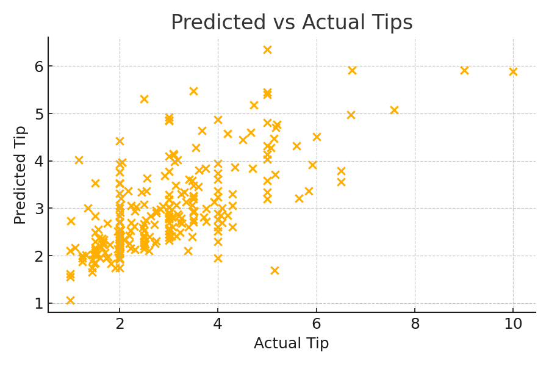
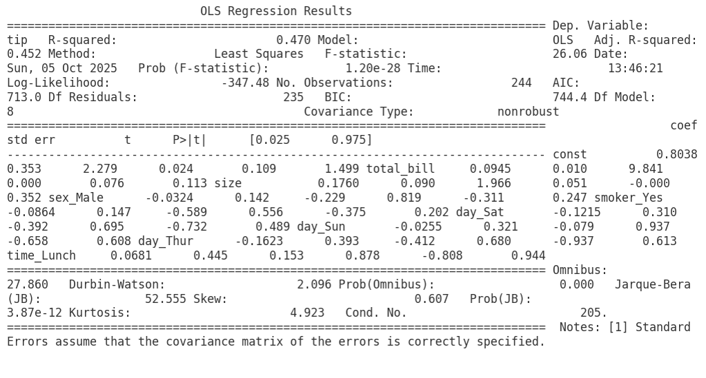

# 🍽️ Restaurant Tips Prediction — Excel Regression Project

### 📊 Overview
This project uses Excel to build a **multiple linear regression** model that predicts customer tip amounts using transactional features (sex, smoker, day, time, size, total bill). It was completed as part of the *Business Analytics with Excel* capstone exercises.

---

### 🎯 Objectives
- Clean and preprocess the dataset.  
- Encode categorical variables for regression.  
- Explore relationships between tip and other features.  
- Build and evaluate a multiple linear regression model using Excel's Data Analysis add-in.  
- Present insights and recommendations to the restaurant operations team.

---

### 🧮 Dataset Description
The dataset contains the following columns:

| Column | Description |
|--------|-------------|
| sex | Customer gender (Male/Female) |
| smoker | Smoker status (Yes/No) |
| day | Day of visit (Thur/Fri/Sat/Sun) |
| time | Meal time (Lunch/Dinner) |
| size | Number of people in the party |
| total bill | Bill amount (USD) |
| tip | Tip amount (USD) — **dependent variable** |

**Dataset Source:** Provided by the *Business Analytics with Excel* course (Simplilearn). Used for educational and reproducibility purposes.

---

### ⚙️ Tools & Skills Used
- **Microsoft Excel** (Pivot Tables, Data Analysis Add-in)  
- Data cleaning & encoding (IF statements / dummy variables)  
- Correlation analysis & multiple linear regression  
- Visualization: pivot charts, regression output screenshots, predicted vs actual plots

---

### 🧭 Process Steps
1. **Data Cleaning**
   - Checked for missing values and duplicates.  
   - Standardized categorical labels.

2. **Feature Engineering**
   - Encoded categorical variables into numeric indicator columns (e.g., `sex_Male`, `smoker_Yes`, `time_Lunch`, `day_Sat` etc.) using Excel formulas.

3. **Exploratory Analysis**
   - Created pivot tables & pivot charts to inspect tip patterns by sex, day, time, and size.

4. **Model Building**
   - Used **Data Analysis → Regression** in Excel.  
   - Dependent variable: `tip`.  
   - Independent variables: `total bill`, `size`, and encoded categorical dummies.  
   - Extracted coefficients, R², Adjusted R² and regression diagnostics.

5. **Prediction & Evaluation**
   - Applied the regression equation to compute predicted tips.  
   - Visualized Predicted vs Actual tips and inspected residuals.  
   - Reported R², Adjusted R² and RMSE.

---

### 📈 Model Results (summary)
- Observations (n): **244**  
- R² = **0.4701**, Adjusted R² = **0.4520**  
- RMSE ≈ **1.005**

**Estimated regression equation (tip in USD):**
---
Tip = 0.803817
+ 0.094487 * (total_bill)
+ 0.175992 * (size)
- 0.032441 * (sex_Male)
- 0.086408 * (smoker_Yes)
- 0.121458 * (day_Sat)
- 0.025481 * (day_Sun)
- 0.162259 * (day_Thur)
+ 0.068129 * (time_Lunch)
---

**Notes on encoding / baseline categories:**  
- `sex_Male` = 1 if Male, 0 if Female → coefficient is relative to **Female**.  
- `smoker_Yes` = 1 if Smoker, 0 if Non-smoker → relative to **Non-smoker**.  
- `day_*` dummies shown are relative to the baseline day (dropped category).  
- `time_Lunch` = 1 for Lunch, 0 for Dinner → coefficient is relative to **Dinner**.

---

### 📈 Visuals

<div align="center">

  <br>
  <em>Figure 1: Predicted vs Actual Tips</em>

  <br><br>

  <br>
  <em>Figure 2: Regression output (coefficients, R²)</em>

</div>


---

### 🧠 Key Insights (brief)
- **Total bill** positively correlates with tip: each additional \$1 in bill → ~\$0.094 higher tip.  
- **Party size** has a positive effect on tip (≈\$0.176 per additional person).  
- Some categorical groups (e.g., smokers, certain days) show lower average tips relative to the baseline.  
- Model explains ~47% of tip variance — reasonable for transaction-level prediction; consider further feature engineering for improvement.

---

### ✅ Results & Recommendations
- Use the regression equation to **estimate expected tips** for staffing and service benchmarking.  
- Consider targeted improvements on days or segments with lower tip rates (e.g., training or service promotions).  
- For improved performance, try feature interactions, nonlinear transforms, or a regularized model.

---

### 📄 Files
- `Restaurant-tips-ashish-COMPLETE-PROJECT2.xlsb` — Excel workbook with full analysis.  
- `02_predicting_restaurant_tips_problem_statement.pdf` — Project problem statement (course-provided).  
- `data/Restaurant-tips-dataset.xlsx` — Full dataset (course-provided).  
- `data/sample_restaurant_tips.csv` — Small sample (first 100 rows) for quick replication.  
- `assets/` — Screenshots: `predicted-vs-actual.png`, `regression-summary.png`, `pivot-charts.png`.

---

### 📂 Repository Structure

```

Restaurant-Tips-Prediction/
├── data/
│   ├── Restaurant-tips-dataset.xlsx
│   └── sample_restaurant_tips.csv
├── assets/
│   ├── pivot-charts.png
│   ├── regression-summary.png
│   └── predicted-vs-actual.png
├── Restaurant-tips-ashish-COMPLETE-PROJECT2.xlsb
├── 02_predicting_restaurant_tips_problem_statement.pdf
└── README.md

```
